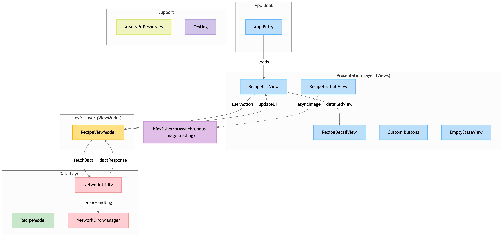

# 🍲 RECIPEARCHIVE – SWIFTUI iOS APP


**RecipeArchive** is a SwiftUI-based iOS app that allows users to browse delicious recipes in a sleek, modern interface. The app features clean MVVM architecture, asynchronous image loading with **Kingfisher**, and robust error handling.

---

## ✨ FEATURES

- ✅ Built entirely using **SwiftUI**
- ✅ Asynchronous image loading via **Kingfisher**
- ✅ MVVM architecture with clear data flow
- ✅ Empty state UI for better UX
- ✅ Unit tested with XCTest
- ✅ Error handling for network failures

---

## 🗺️ ARCHITECTURE DIAGRAM



---

## 📁 PROJECT STRUCTURE

### 🔹 App Boot

- [App Entry (RecipeArchiveApp.swift)](https://github.com/akshat151/recipearchive/blob/main/RecipeArchive/RecipeArchiveApp.swift)

### 🔹 Presentation Layer (Views)

- [RecipeListView](https://github.com/akshat151/recipearchive/blob/main/RecipeArchive/View/RecipeListView.swift)  
- [RecipeDetailView](https://github.com/akshat151/recipearchive/blob/main/RecipeArchive/View/RecipeDetailView.swift)  
- [Custom Buttons](https://github.com/akshat151/recipearchive/tree/main/RecipeArchive/View/Custom%20Buttons)  
- [EmptyStateView](https://github.com/akshat151/recipearchive/blob/main/RecipeArchive/View/EmptyStateView.swift)  
- [RecipeListCellView](https://github.com/akshat151/recipearchive/blob/main/RecipeArchive/View/RecipeListCellView.swift)

### 🔹 Logic Layer (ViewModel)

- [RecipeViewModel](https://github.com/akshat151/recipearchive/blob/main/RecipeArchive/ViewModel/RecipeViewModel.swift)

### 🔹 Data & Utility Layer

- [RecipeModel](https://github.com/akshat151/recipearchive/blob/main/RecipeArchive/Model/RecipeModel.swift)  
- [NetworkUtility](https://github.com/akshat151/recipearchive/blob/main/RecipeArchive/Utilities/NetworkUtility.swift)  
- [NetworkErrorManager](https://github.com/akshat151/recipearchive/blob/main/RecipeArchive/Utilities/NetworkErrorManager.swift)

### 🔹 Support Files

- [Assets & Resources](https://github.com/akshat151/recipearchive/blob/main/RecipeArchive/Assets.xcassets)  
- [Testing Suite](https://github.com/akshat151/recipearchive/blob/main/RecipeArchiveTests/RecipeArchiveTests.swift)

### 🔹 External Dependency

- **Kingfisher** – Used for downloading and caching images asynchronously  
  📦 Add via Swift Package Manager:
  ```swift
     https://github.com/onevcat/Kingfisher.git


---

🧭 GETTING STARTED

🛠️ REQUIREMENTS
	•	Xcode 15+
	•	iOS 15+
	•	Swift 5+

🚀 LOCAL RUN
	1.	Clone the repository
  2.	Open in Xcode
	    Double click RecipeArchive.xcodeproj or open via Xcode.
  3.	Build & Run
	    Run the project on a simulator or real iOS device.

---

📦 OPTIONAL SETUP
	•	The app uses Kingfisher via Swift Package Manager.
	•	To update dependencies:
File > Packages > Update to Latest Package Versions

---

✅ TESTING

Unit tests are located in the RecipeArchiveTests target.
To run tests:

⌘ + U (in Xcode)

You can find the test file here:
RecipeArchiveTests.swift

---

📚 LICENSE

This project is licensed under the MIT License. See the LICENSE file for more details.

---

🙌 CREDITS

Created by Akshat with ❤️ using SwiftUI, for those who love cooking as much as clean code.


---

Need help with:
	•	🧪 UI snapshot testing
	•	📦 Swift Package auto-integration
	•	🚀 TestFlight / App Store deployment setup?
Let me know!
